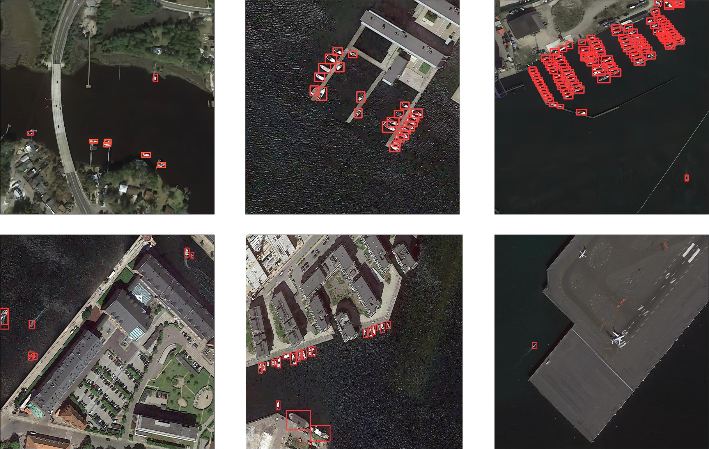

# LRS2-DM
The study focuses on addressing the challenge of small object detection in low-resolution remote sensing imagery. 

# 🚢 LRS2-DM: Small Ship Target Detection in Low-Resolution Remote Sensing Images Based on Diffusion Models

  

## 📌 Introduction

To mitigate resolution limitations, the method incorporates cognitive-conditioned input and a low-level super-resolution module to generate reference images as auxiliary guidance. This enhances the quality of the super-resolved outputs. Additionally, to compensate for the loss of fine details in small targets, a spatial refinement module is employed. This module sharpens object-level features and improves the accuracy of ship detection in remote sensing scenes.

## 🧠 Key Contributions

Enhanced Image Clarity: Cognitive conditions and a low-level super-resolution module are integrated to address blurred ship features in low-resolution remote sensing images, with diffusion models enhancing resolution through task-specific textual prior knowledge.

Improved Small Target Detection: A spatial refinement module compensates for missing texture and detail in small targets, refining features and improving detection accuracy through spatial structure transfer.

Optimized Loss Module: An optimized loss function enhances network integration, mitigates noise from diffusion models, and adapts to various detection tasks, ensuring model stability.

## 📊 Result

  

📭 Contact
If your have any comments or questions, feel free to contact chenyantong@dlmu.edu.cn.
